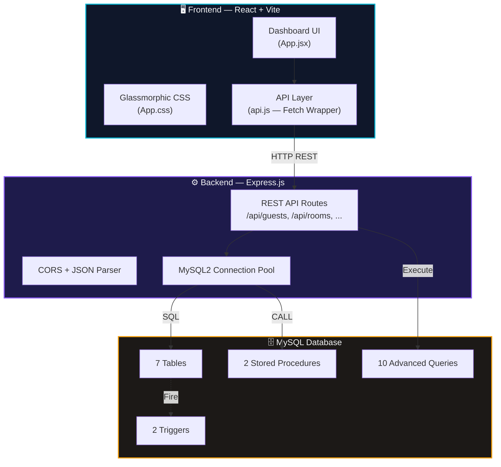
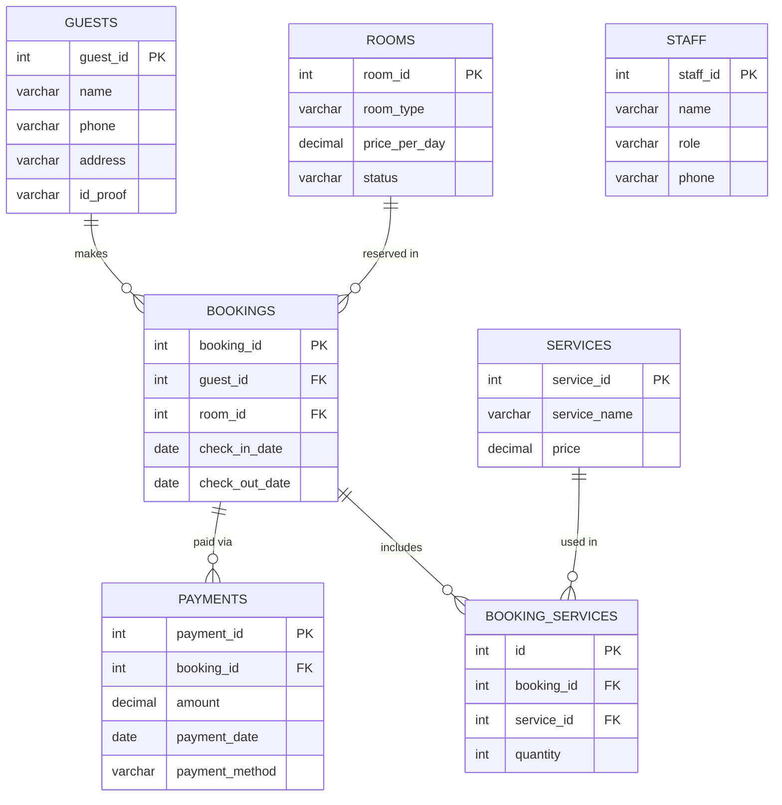
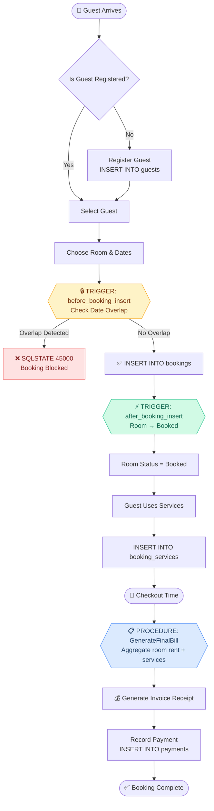
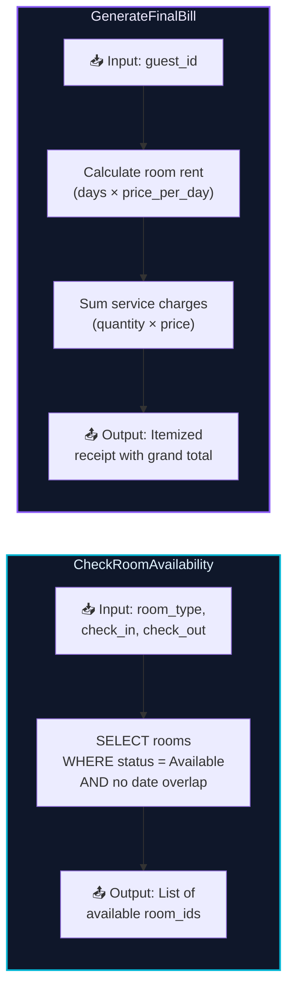
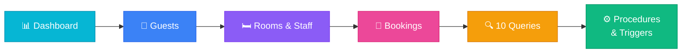
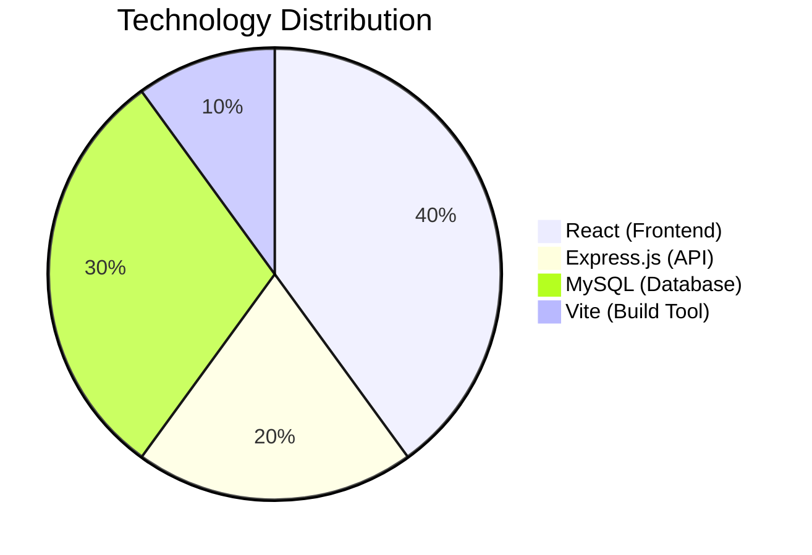

<](https://www.mysql.com/)
[](https://react.dev/)
[](https://expressjs.com/)
[](https://nodejs.org/)
[](https://vitejs.dev/)

---

**InnKeep** is a production-grade hotel management system built as a comprehensive DBMS project.  
It demonstrates end-to-end database design — from schema normalization and stored procedures to trigger-based integrity enforcement — wrapped in a stunning glassmorphic React dashboard.

</div>

---

## ✨ Feature Highlights

| Category | Features |
|---|---|
| 🗃️ **Database Design** | 7 normalized tables, foreign key constraints, cascade rules |
| ⚡ **Stored Procedures** | `CheckRoomAvailability`, `GenerateFinalBill` with dynamic aggregation |
| 🔒 **Triggers** | `after_booking_insert` (auto status flip), `before_booking_insert` (overlap guard) |
| 🔍 **10 Advanced Queries** | Joins, subqueries, aggregations, GROUP BY, HAVING — all runnable from the UI |
| 🎨 **Premium UI** | Glassmorphic dark theme, micro-animations, responsive layout |
| 📊 **Live Dashboard** | Real-time room status grid, guest/booking/payment metrics |
| 🧾 **Invoice System** | Auto-generated printable receipt via stored procedure |
| 🛡️ **Full CRUD** | Insert, Update, Delete operations on Guests, Rooms, Staff, Bookings, Payments |

---

## 🏗️ System Architecture



---

## 🗂️ Entity-Relationship Diagram



---

## 🔄 Booking Lifecycle Flowchart



---

## 🔐 Stored Procedures & Triggers

### Stored Procedures



### Triggers

| Trigger | Event | Action |
|---|---|---|
| `after_booking_insert` | After `INSERT` on `bookings` | Sets the booked room's status to `"Booked"` |
| `before_booking_insert` | Before `INSERT` on `bookings` | Checks for date overlap on the same room; raises `SQLSTATE 45000` if conflict found |

---

## 🔍 The 10 SQL Queries

| # | Query Description | SQL Concepts Used |
|---|---|---|
| 1 | List all guests with their booking details | `INNER JOIN` |
| 2 | Find rooms that have never been booked | `LEFT JOIN`, `IS NULL` |
| 3 | Calculate total revenue per room type | `GROUP BY`, `SUM`, `JOIN` |
| 4 | Find the guest with the most bookings | `COUNT`, `GROUP BY`, `ORDER BY`, `LIMIT` |
| 5 | List bookings with total payment amounts | `LEFT JOIN`, `SUM`, `GROUP BY` |
| 6 | Find rooms booked in a specific date range | `WHERE`, `BETWEEN` |
| 7 | List staff members and the number of rooms they manage | `JOIN`, `COUNT`, `GROUP BY` |
| 8 | Find guests who have used specific services | `INNER JOIN`, multi-table join |
| 9 | Calculate average room price by type | `AVG`, `GROUP BY` |
| 10 | Find bookings where payment exceeds room price | `HAVING`, `Subquery`, `Comparison` |

---

## 📁 Project Structure

```
DBMS-ad044-project/
│
├── 📄 README.md                    ← You are here
├── 📦 package.json                 ← Root project metadata
│
├── 🗄️ database/
│   ├── schema.sql                  ← Tables, triggers, stored procedures, mock data
│   └── queries.sql                 ← The 10 required SQL queries with commentary
│
├── ⚙️ backend/
│   ├── package.json                ← Express dependencies
│   ├── server.js                   ← REST API routes, procedure calls, trigger demos
│   └── .env                        ← MySQL credentials (DB_PASSWORD)
│
└── 🖥️ frontend/
    ├── package.json                ← React / Vite dependencies
    ├── index.html                  ← Entry point
    ├── vite.config.js              ← Dev server config (port 3000 → proxy to 5000)
    └── src/
        ├── App.jsx                 ← Full dashboard UI (CRUD, procedures, triggers)
        ├── App.css                 ← Premium glassmorphic vanilla CSS stylesheet
        └── api.js                  ← Fetch wrapper for backend API calls
```

---

## 🚀 Quick Start Guide

### Prerequisites

- **Node.js** v18+ and **npm** 
- **MySQL** 8.0+ (with root access)

### Step 1 — Initialize the Database

```bash
cd DBMS-ad044-project
mysql -u root -p < database/schema.sql
```

Verify it worked:
```sql
mysql -u root -p
USE hotel_management;
SHOW TABLES;
-- You should see: bookings, booking_services, guests, payments, rooms, services, staff
```

### Step 2 — Start the Backend

```bash
cd backend
npm install
```

Edit `backend/.env` and set your MySQL password:
```env
DB_PASSWORD=your_actual_mysql_password
```

```bash
npm run dev
```
> ✅ Expected: `Backend server listening on http://localhost:5000`

### Step 3 — Start the Frontend

```bash
cd frontend
npm install
npm run dev
```
> ✅ Expected: Vite opens `http://localhost:3000` in your browser

---

## 🖥️ Application Walkthrough



| Tab | What You Can Do |
|---|---|
| **📊 Dashboard** | View live room status grid, occupancy metrics, quick refresh |
| **👥 Guests** | Add / Edit / Delete guests, search by name/phone/ID |
| **🛏️ Rooms & Staff** | Manage room catalogue, register/edit staff members |
| **📅 Bookings** | Create reservations (triggers auto-fire), record payments |
| **🔍 10 Queries** | Execute any of the 10 queries, view SQL code + result grid |
| **⚙️ Procedures & Triggers** | Run `CheckRoomAvailability`, `GenerateFinalBill`, trigger demos |

---

## 🧪 Testing Triggers (Demo)

### Trigger 1 — Auto Room Status Update
1. Go to **📅 Bookings** → create a booking for an *Available* room
2. Watch the room card on **📊 Dashboard** flip from 🟢 Available → 🔵 Booked

### Trigger 2 — Date Overlap Prevention
1. Go to **⚙️ Procedures & Triggers** → Trigger Demo section
2. Try booking **Room 23** from `2026-06-12` to `2026-06-15` (already booked)
3. The database fires `SQLSTATE 45000` and the UI shows the error alert

---

## 📊 Tech Stack Summary



---

## 🤝 Contributing

1. Fork the repository
2. Create a feature branch (`git checkout -b feature/amazing-feature`)
3. Commit changes (`git commit -m 'Add amazing feature'`)
4. Push to branch (`git push origin feature/amazing-feature`)
5. Open a Pull Request

---

## 📄 License

This project is licensed under the **ISC License**.

---

<div align="center">

**Built with ❤️ by InnKeep Team**

_A DBMS Project — Database Systems Course_

</div>
]]>
